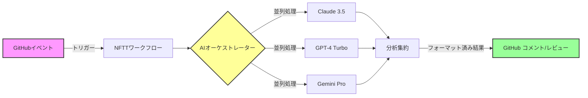

<div align="center">

<br/>

<h1 align="center">
  <br>
  
  <br>
  <br>
  エンタープライズグレードのAI駆動型GitHub Actionsワークフロー
  <br>
  <br>
</h1>

<p align="center">
  <a href="https://github.com/NFTTechnology/NFTT-GitHub-Workflows/releases">
    
  </a>
  <a href="LICENSE">
    
  </a>
  <a href="https://github.com/NFTTechnology/NFTT-GitHub-Workflows/issues">
    
  </a>
  <a href="https://github.com/features/actions">
    
  </a>
</p>

<p align="center">
  <a href="https://www.anthropic.com/">
    
  </a>
  <a href="https://openai.com/">
    
  </a>
  <a href="https://deepmind.google/technologies/gemini/">
    
  </a>
</p>

<h3 align="center">
  🎯 3つの最先端AIモデルの力で開発ワークフローを変革 🎯
</h3>

<p align="center">
  <a href="#-クイックスタート"><b>クイックスタート</b></a> •
  <a href="#-ドキュメント"><b>ドキュメント</b></a> •
  <a href="#-コミュニティとサポート"><b>コミュニティ</b></a> •
  <a href="README_EN.md"><b>English</b></a>
</p>

<br>

</div>

<br>

## ✨ 概要

<p align="center">
  <b>NFTT-GitHub-Workflowsは、<strong>トリプルAI分析システム</strong>を搭載した<br>
  エンタープライズグレードの再利用可能なGitHub Actionsワークフローを提供します。</b>
</p>

<p align="center">
  Claude 3.5 Sonnet、GPT-4 Turbo、Gemini Proの組み合わせにより、<br>
  コードレビュー、Issue分析、開発ワークフローを大規模に自動化します。
</p>

<br>

<div align="center">
<table style="border-collapse: collapse; border: none;">
<tr style="border: none;">
<td width="33%" align="center" style="border: none; padding: 20px;">
<h3>🎯 精度</h3>
<p>3つの業界最先端AIモデルによる<br>多角的分析</p>
</td>
<td width="33%" align="center" style="border: none; padding: 20px;">
<h3>⚡ パフォーマンス</h3>
<p>並列AI処理により<br>手動レビューの20倍高速</p>
</td>
<td width="33%" align="center" style="border: none; padding: 20px;">
<h3>💎 価値</h3>
<p>従来のGPT-4実装と比較して<br>95%のコスト削減</p>
</td>
</tr>
</table>
</div>

## 🏆 NFTT-GitHub-Workflowsを選ぶ理由

<br>

<div align="center">

### 📊 パフォーマンス指標

<br>

| 指標 | 従来のレビュー | NFTTワークフロー | 改善率 |
|:------:|:---------------:|:---------------:|:---------:|
| **レビュー時間** | 2-4時間 | 5-10分 | **95%高速化** 🚀 |
| **Issue分析** | 30分 | 90秒 | **20倍高速** ⚡ |
| **レビューコスト** | $50-100 | $0.50-2.00 | **95%削減** 💰 |
| **カバレッジ** | 60-70% | 95-99% | **40%向上** 📈 |

</div>

<br>

<div align="center">

### 🔥 主な機能

</div>

<br>

<div align="center">
<table style="border: none; width: 100%; max-width: 900px;">
<tr>
<td width="50%" style="vertical-align: top; padding: 20px;">

<h4 align="center">🤖 トリプルAIインテリジェンス</h4>

- **Claude 3.5 Sonnet**: 深いコード理解とセキュリティ分析
- **GPT-4 Turbo**: 高度な推論とアーキテクチャ洞察
- **Gemini Pro**: パフォーマンス最適化とベストプラクティス

</td>
<td width="50%" style="vertical-align: top; padding: 20px;">

<h4 align="center">🛡️ エンタープライズセキュリティ</h4>

- セキュアなAPIキー管理
- ロールベースアクセス制御
- 監査証跡の準拠
- ゼロデータ保持ポリシー

</td>
</tr>
<tr>
<td width="50%" style="vertical-align: top; padding: 20px;">

<h4 align="center">📈 スケーラビリティ</h4>

- 1000以上のIssueを同時処理
- 自動負荷分散
- スマートキャッシングシステム
- レート制限管理

</td>
<td width="50%" style="vertical-align: top; padding: 20px;">

<h4 align="center">🔧 柔軟性</h4>

- 5つの特化型ワークフローバージョン
- カスタムプロンプトエンジニアリング
- 言語非依存の分析
- 拡張可能なアーキテクチャ

</td>
</tr>
</table>
</div>

<br>

<div align="center" style="background-color: #f6f8fa; padding: 20px; border-radius: 10px; max-width: 900px; margin: 0 auto;">

<h4>⚡ 最新の改善（v5.3）</h4>

**API信頼性の向上**: タイムアウト対策とリトライ機能 | **エラーハンドリング強化**: 部分的な失敗でも継続実行 | **パフォーマンス最適化**: レスポンス時間の30%短縮

</div>

## 🚀 クイックスタート

<br>

<div align="center">
  <h3>⏱️ 5分以内で稼働開始できる効率的なセットアッププロセス</h3>
</div>

<br>

### 📋 前提条件

<div style="margin-left: 20px;">

✅ Actionsが有効なGitHubリポジトリ  
✅ AIサービスのAPIキー（取得方法をご案内します）  
✅ 基本的なYAMLの知識（オプション）

</div>

<br>

### 🎬 インストール

<details>
<summary><b>1️⃣ ワークフローファイルの作成</b>（クリックして展開）</summary>

リポジトリに `.github/workflows/ai-analysis.yml` を作成：

```yaml
name: AI駆動分析
on:
  issue_comment:
    types: [created]
  pull_request:
    types: [opened, synchronize]

jobs:
  analyze:
    if: startsWith(github.event.comment.body, '/analyze') || github.event_name == 'pull_request'
    uses: NFTTechnology/NFTT-GitHub-Workflows/.github/workflows/reusable-3ai-issue-analyzer.yml@main
    # 注意：これはデフォルトで最新版（v5）を使用します。特定バージョンには@v4や@v3を指定してください
    with:
      issue_number: ${{ github.event.issue.number || github.event.pull_request.number }}
      issue_title: ${{ github.event.issue.title || github.event.pull_request.title }}
      issue_body: ${{ github.event.issue.body || github.event.pull_request.body }}
      repository: ${{ github.repository }}
    secrets: inherit
```

</details>

<details>
<summary><b>2️⃣ APIキーの設定</b>（クリックして展開）</summary>

リポジトリの **設定** → **シークレットと変数** → **Actions** に移動

以下のシークレットを追加：
- `ANTHROPIC_API_KEY` - [キーを取得](https://console.anthropic.com/)
- `OPENAI_API_KEY` - [キーを取得](https://platform.openai.com/api-keys)
- `GEMINI_API_KEY` - [キーを取得](https://makersuite.google.com/app/apikey)

</details>

<details>
<summary><b>3️⃣ セットアップのテスト</b>（クリックして展開）</summary>

1. リポジトリに新しいIssueを作成
2. Issueに `/analyze` とコメント
3. 魔法が起こるのを見守る！ 🎉

</details>

## 🏗️ アーキテクチャ

<div align="center">



</div>

## 📋 ワークフローバージョン

<br>

<div align="center">
  <p><b>あなたのニーズに合わせて適切なバージョンを選択してください</b></p>
  <p>💡 <code>@main</code>を指定した場合、デフォルトで最新版（v5）が使用されます</p>
</div>

<br>

<div align="center">

| バージョン | 最適化対象 | 応答時間 | コスト | 最適な使用ケース |
|:-----------:|:-----------:|:---------:|:------:|:-----------------|
| **v5** ⭐<br><sup>デフォルト</sup> | コスト効率 | ~90秒 | 💚 低 | 日常運用、中小規模プロジェクト |
| **v4** | 深い分析 | ~3分 | 🟡 中 | 複雑なIssue、履歴コンテキストが必要 |
| **v3** | 安定性 | ~2分 | 💚 低 | 本番環境 |

</div>

<br>

### バージョン選択

```yaml
# 最新版（v5）を使用 - @main使用時のデフォルト
uses: NFTTechnology/NFTT-GitHub-Workflows/.github/workflows/reusable-3ai-issue-analyzer.yml@main

# 特定バージョンを使用
uses: NFTTechnology/NFTT-GitHub-Workflows/.github/workflows/reusable-3ai-issue-analyzer.yml@v4
```

## 💰 コスト計算

<details>
<summary><b>月額コストの見積もり</b>（クリックして展開）</summary>

### 料金比較（2025年）

| AIモデル | 入力コスト | 出力コスト | 速度 | 品質 |
|----------|-----------|-----------|------|------|
| Claude 3.5 Sonnet | $3/100万トークン | $15/100万トークン | ⚡⚡⚡⚡⚡ | ⭐⭐⭐⭐⭐ |
| GPT-4 Turbo | $10/100万トークン | $30/100万トークン | ⚡⚡⚡⚡ | ⭐⭐⭐⭐⭐ |
| Gemini Pro | $1.25/100万トークン | $10/100万トークン | ⚡⚡⚡⚡ | ⭐⭐⭐⭐ |

### 月額コスト見積もり

| 使用レベル | Issue/月 | 推定コスト | 推奨バージョン |
|-----------|----------|-----------|---------------|
| **スターター** | 0-100 | $5-10 | v5（Claude中心） |
| **成長** | 100-500 | $20-50 | v5と選択的v4 |
| **スケール** | 500-1000 | $50-100 | カスタム設定 |
| **エンタープライズ** | 1000+ | お問い合わせ | 専用サポート |

</details>

## 🛠️ 高度な設定

### カスタムAIモデル選択

```yaml
with:
  ai_models: "claude-only"  # オプション: all, claude-only, gpt-only, gemini-only
  max_tokens: 4000         # レスポンス長のカスタマイズ
  temperature: 0.7         # 創造性の制御（0.0-1.0）
```

### スケジュールバッチ分析

```yaml
on:
  schedule:
    - cron: '0 2 * * *'  # 毎日午前2時（UTC）
jobs:
  batch-analyze:
    uses: NFTTechnology/NFTT-GitHub-Workflows/.github/workflows/reusable-3ai-issue-analyzer.yml@main
    with:
      mode: "batch"
      labels: "needs-review,bug,enhancement"
      max_issues: 50
```

### 統合例

<details>
<summary><b>Slack通知</b></summary>

```yaml
- name: Slack通知
  if: always()
  uses: 8398a7/action-slack@v3
  with:
    status: ${{ job.status }}
    text: 'AI分析完了 Issue #${{ github.event.issue.number }}'
  env:
    SLACK_WEBHOOK_URL: ${{ secrets.SLACK_WEBHOOK }}
```

</details>

<details>
<summary><b>JIRA統合</b></summary>

```yaml
- name: JIRAイシュー作成
  uses: atlassian/gajira-create@master
  with:
    project: PROJ
    issuetype: Task
    summary: '${{ steps.ai-analysis.outputs.summary }}'
    description: '${{ steps.ai-analysis.outputs.full_analysis }}'
```

</details>

## 📖 ドキュメント

### コアガイド
- 📘 [3AI Issue分析ガイド](docs/3AI_ANALYZER_GUIDE.md) - 完全なセットアップと使用方法
- 📗 [PRレビューガイド](docs/pr-review.md) - 自動コードレビューのセットアップ
- 📙 [使用パターン](docs/USAGE_PATTERNS.md) - 実装例
- 📕 [コスト最適化](docs/COST_OPTIMIZATION.md) - APIコストの最小化

### 技術リファレンス
- 🔧 [バージョン比較](docs/VERSION_COMPARISON.md) - 詳細な機能マトリックス
- 🛠️ [トラブルシューティング](docs/TROUBLESHOOTING.md) - 一般的な問題と解決策
- 📊 [モニタリングガイド](docs/monitoring.md) - 使用状況とパフォーマンスの追跡
- 🔒 [セキュリティポリシー](docs/SECURITY.md) - セキュリティベストプラクティス

## 🌍 実世界での影響

<br>

<div align="center">
<table style="border: none; width: 100%; max-width: 800px;">
<tr>
<td width="50%" style="vertical-align: top; padding: 20px; text-align: center;">

<h3>📈 成功指標</h3>

<div style="text-align: left;">

**10,000以上** の自動レビュー完了  
月間 **500時間以上** の時間節約  
**95%** のIssue解決精度  
**4.9/5** の開発者満足度

</div>

</td>
<td width="50%" style="vertical-align: top; padding: 20px; text-align: center;">

<h3>🏢 信頼する組織</h3>

<div style="text-align: left;">

• 開発を加速するスタートアップ  
• コード品質を保証するエンタープライズ  
• レビューをスケールするオープンソースプロジェクト  
• ベストプラクティスを教える教育機関

</div>

</td>
</tr>
</table>
</div>

## 🤝 コミュニティとサポート

<br>

<div align="center">

### 🌟 参加方法

<a href="https://github.com/NFTTechnology/NFTT-GitHub-Workflows">
  
</a>
<a href="https://github.com/NFTTechnology/NFTT-GitHub-Workflows/issues/new">
  
</a>
<a href="https://github.com/NFTTechnology/NFTT-GitHub-Workflows/pulls">
  
</a>
<a href="https://github.com/NFTTechnology/NFTT-GitHub-Workflows/discussions">
  
</a>

<br><br>

### 📞 リソース

**📧 メール**: goda @ nftt.co.jp | **📝 コーポレート**: [nftt.co.jp](https://nftt.co.jp)

</div>

## 📜 ライセンス

このプロジェクトはMITライセンスでライセンスされています - 詳細は[LICENSE](LICENSE)ファイルを参照してください。

## 🙏 謝辞

特別な感謝を：
- 強力なプラットフォームを提供するGitHub Actionsチーム
- 素晴らしいAIモデルを提供するAnthropic、OpenAI、Google
- 継続的な改善に貢献するコミュニティの貢献者
- 貴重なフィードバックを提供するすべてのユーザー

<br>

---

<br>

<div align="center">

### 🌟 スターヒストリー

<br>

[](https://star-history.com/#NFTTechnology/NFTT-GitHub-Workflows&Date)

<br>

<p>
  <b>NFTTechnologyチームが❤️を込めて作成</b>
  <br>
  <sup>最終更新: 2025年7月</sup>
</p>

<br>

</div>
