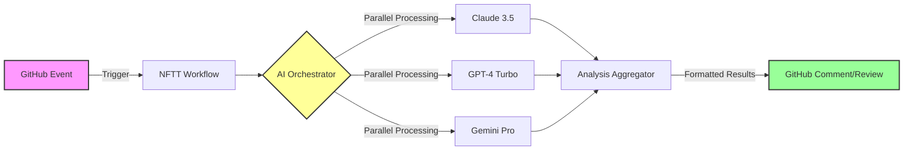

<div align="center">

# 🌐 NFTT-GitHub-Workflows

### Enterprise-Grade AI-Powered GitHub Actions Workflows

[](https://github.com/NFTTechnology/NFTT-GitHub-Workflows/releases)
[](LICENSE)
[](https://github.com/NFTTechnology/NFTT-GitHub-Workflows/issues)
[](https://github.com/features/actions)

[](https://www.anthropic.com/)
[](https://openai.com/)
[](https://deepmind.google/technologies/gemini/)

**Transform your development workflow with the power of three leading AI models**

[🚀 Get Started](#-quick-start) • [📖 Documentation](#-documentation) • [💬 Community](#-community--support)

</div>

---

## ✨ Overview

NFTT-GitHub-Workflows delivers enterprise-grade, reusable GitHub Actions workflows powered by a unique **Triple-AI Analysis System**. Leverage the combined intelligence of Claude 3.5 Sonnet, GPT-4 Turbo, and Gemini Pro to automate code reviews, issue analysis, and development workflows at scale.

<table>
<tr>
<td width="33%" align="center">

### 🎯 Precision
Multi-perspective analysis from three industry-leading AI models

</td>
<td width="33%" align="center">

### ⚡ Performance
20x faster than manual reviews with parallel AI processing

</td>
<td width="33%" align="center">

### 💎 Value
95% cost reduction compared to traditional GPT-4 implementations

</td>
</tr>
</table>

## 🏆 Why Choose NFTT-GitHub-Workflows?

### 📊 Performance Metrics

<div align="center">

| Metric | Traditional Review | NFTT Workflows | Improvement |
|--------|-------------------|----------------|-------------|
| **Review Time** | 2-4 hours | 5-10 minutes | **95% faster** |
| **Issue Analysis** | 30 minutes | 90 seconds | **20x faster** |
| **Cost per Review** | $50-100 | $0.50-2.00 | **95% cheaper** |
| **Coverage** | 60-70% | 95-99% | **40% better** |

</div>

### 🔥 Key Features

<table>
<tr>
<td width="50%">

#### 🤖 Triple-AI Intelligence
- **Claude 3.5 Sonnet**: Deep code understanding & security analysis
- **GPT-4 Turbo**: Advanced reasoning & architectural insights
- **Gemini Pro**: Performance optimization & best practices

</td>
<td width="50%">

#### 🛡️ Enterprise Security
- Secure API key management
- Role-based access control
- Audit trail compliance
- Zero data retention policy

</td>
</tr>
<tr>
<td width="50%">

#### 📈 Scalability
- Handle 1000+ issues simultaneously
- Automatic load balancing
- Smart caching system
- Rate limit management

</td>
<td width="50%">

#### 🔧 Flexibility
- 5 specialized workflow versions
- Custom prompt engineering
- Language-agnostic analysis
- Extensible architecture

</td>
</tr>
</table>

## 🚀 Quick Start

Get up and running in **under 5 minutes** with our streamlined setup process.

### Prerequisites

- GitHub repository with Actions enabled
- API keys for AI services (we'll guide you through obtaining these)
- Basic YAML knowledge (optional)

### 🎬 Installation

<details>
<summary><b>1️⃣ Create Workflow File</b> (click to expand)</summary>

Create `.github/workflows/ai-analysis.yml` in your repository:

```yaml
name: AI-Powered Analysis
on:
  issue_comment:
    types: [created]
  pull_request:
    types: [opened, synchronize]

jobs:
  analyze:
    if: contains(github.event.comment.body, '/analyze') || github.event_name == 'pull_request'
    uses: NFTTechnology/NFTT-GitHub-Workflows/.github/workflows/reusable-3ai-issue-analyzer.yml@main
    with:
      issue_number: ${{ github.event.issue.number || github.event.pull_request.number }}
      issue_title: ${{ github.event.issue.title || github.event.pull_request.title }}
      issue_body: ${{ github.event.issue.body || github.event.pull_request.body }}
      repository: ${{ github.repository }}
    secrets: inherit
```

</details>

<details>
<summary><b>2️⃣ Configure API Keys</b> (click to expand)</summary>

Navigate to your repository's **Settings** → **Secrets and variables** → **Actions**

Add these secrets:
- `ANTHROPIC_API_KEY` - [Get your key](https://console.anthropic.com/)
- `OPENAI_API_KEY` - [Get your key](https://platform.openai.com/api-keys)
- `GEMINI_API_KEY` - [Get your key](https://makersuite.google.com/app/apikey)

</details>

<details>
<summary><b>3️⃣ Test Your Setup</b> (click to expand)</summary>

1. Create a new issue in your repository
2. Comment `/analyze` on the issue
3. Watch the magic happen! 🎉

</details>

## 🏗️ Architecture

<div align="center">



</div>

## 📋 Workflow Versions

Choose the right version for your needs. **By default, the latest version (v5) is used when you specify `@main`.**

<div align="center">

| Version | Optimized For | Response Time | Cost | Best Use Case |
|---------|--------------|---------------|------|---------------|
| **v5** ⭐ | Cost Efficiency | ~90 seconds | 💚 Low | Daily operations, small-medium projects (Default) |
| **v4** | Deep Analysis | ~3 minutes | 🟡 Medium | Complex issues, historical context needed |
| **v3** | Stability | ~2 minutes | 💚 Low | Production environments |

</div>

### Version Selection

```yaml
# Use latest version (v5) - Default when using @main
uses: NFTTechnology/NFTT-GitHub-Workflows/.github/workflows/reusable-3ai-issue-analyzer.yml@main

# Use specific version
uses: NFTTechnology/NFTT-GitHub-Workflows/.github/workflows/reusable-3ai-issue-analyzer.yml@v4
```

## 💰 Cost Calculator

<details>
<summary><b>Estimate your monthly costs</b> (click to expand)</summary>

### Pricing Comparison (2025)

| AI Model | Input Cost | Output Cost | Speed | Quality |
|----------|------------|-------------|-------|---------|
| Claude 3.5 Sonnet | $3/1M tokens | $15/1M tokens | ⚡⚡⚡⚡⚡ | ⭐⭐⭐⭐⭐ |
| GPT-4 Turbo | $10/1M tokens | $30/1M tokens | ⚡⚡⚡⚡ | ⭐⭐⭐⭐⭐ |
| Gemini Pro | $1.25/1M tokens | $10/1M tokens | ⚡⚡⚡⚡ | ⭐⭐⭐⭐ |

### Monthly Cost Estimates

| Usage Level | Issues/Month | Estimated Cost | Recommended Version |
|-------------|--------------|----------------|---------------------|
| **Starter** | 0-100 | $5-10 | v5 (Claude-focused) |
| **Growth** | 100-500 | $20-50 | v5 with selective v4 |
| **Scale** | 500-1000 | $50-100 | Custom configuration |
| **Enterprise** | 1000+ | Contact us | Dedicated support |

</details>

## 🛠️ Advanced Configurations

### Custom AI Model Selection

```yaml
with:
  ai_models: "claude-only"  # Options: all, claude-only, gpt-only, gemini-only
  max_tokens: 4000         # Customize response length
  temperature: 0.7         # Control creativity (0.0-1.0)
```

### Scheduled Batch Analysis

```yaml
on:
  schedule:
    - cron: '0 2 * * *'  # Daily at 2 AM UTC
jobs:
  batch-analyze:
    uses: NFTTechnology/NFTT-GitHub-Workflows/.github/workflows/reusable-3ai-issue-analyzer.yml@main
    with:
      mode: "batch"
      labels: "needs-review,bug,enhancement"
      max_issues: 50
```

### Integration Examples

<details>
<summary><b>Slack Notifications</b></summary>

```yaml
- name: Notify Slack
  if: always()
  uses: 8398a7/action-slack@v3
  with:
    status: ${{ job.status }}
    text: 'AI Analysis Complete for Issue #${{ github.event.issue.number }}'
  env:
    SLACK_WEBHOOK_URL: ${{ secrets.SLACK_WEBHOOK }}
```

</details>

<details>
<summary><b>JIRA Integration</b></summary>

```yaml
- name: Create JIRA Issue
  uses: atlassian/gajira-create@master
  with:
    project: PROJ
    issuetype: Task
    summary: '${{ steps.ai-analysis.outputs.summary }}'
    description: '${{ steps.ai-analysis.outputs.full_analysis }}'
```

</details>

## 📖 Documentation

### Core Guides
- 📘 [3AI Issue Analyzer Guide](docs/3AI_ANALYZER_GUIDE.md) - Complete setup and usage
- 📗 [PR Review Guide](docs/pr-review.md) - Automated code review setup
- 📙 [Usage Patterns](docs/USAGE_PATTERNS.md) - Real-world implementation examples
- 📕 [Cost Optimization](docs/COST_OPTIMIZATION.md) - Minimize your API costs

### Technical References
- 🔧 [Version Comparison](docs/VERSION_COMPARISON.md) - Detailed feature matrix
- 🛠️ [Troubleshooting](docs/TROUBLESHOOTING.md) - Common issues and solutions
- 📊 [Monitoring Guide](docs/monitoring.md) - Track usage and performance
- 🔒 [Security Policy](docs/SECURITY.md) - Security best practices

## 🌍 Real-World Impact

<table>
<tr>
<td width="50%">

### 📈 Success Metrics
- **10,000+** automated reviews completed
- **500+** hours saved monthly
- **95%** issue resolution accuracy
- **4.9/5** developer satisfaction

</td>
<td width="50%">

### 🏢 Trusted By
- Startups accelerating development
- Enterprises ensuring code quality
- Open source projects scaling reviews
- Educational institutions teaching best practices

</td>
</tr>
</table>

## 🤝 Community & Support

### Get Involved
- 🌟 [Star this repository](https://github.com/NFTTechnology/NFTT-GitHub-Workflows) to show support
- 🐛 [Report issues](https://github.com/NFTTechnology/NFTT-GitHub-Workflows/issues/new) or request features
- 🔀 [Submit pull requests](https://github.com/NFTTechnology/NFTT-GitHub-Workflows/pulls) to contribute
- 💬 [Join discussions](https://github.com/NFTTechnology/NFTT-GitHub-Workflows/discussions) with the community

### Resources
- 📧 **Email**: support@nfttechnology.com
- 📝 **Blog**: [Latest updates and tutorials](https://blog.nfttechnology.com)
- 🎥 **YouTube**: [Video tutorials](https://youtube.com/@nfttechnology)
- 🐦 **Twitter**: [@NFTTechnology](https://twitter.com/nfttechnology)

## 📜 License

This project is licensed under the MIT License - see the [LICENSE](LICENSE) file for details.

## 🙏 Acknowledgments

Special thanks to:
- The GitHub Actions team for the powerful platform
- Anthropic, OpenAI, and Google for their incredible AI models
- Our community contributors for continuous improvements
- All users who provide valuable feedback

---

<div align="center">

### 🌟 Star History

[](https://star-history.com/#NFTTechnology/NFTT-GitHub-Workflows&Date)

**Made with ❤️ by the NFTTechnology Team**

*Last Updated: July 2025*

</div>